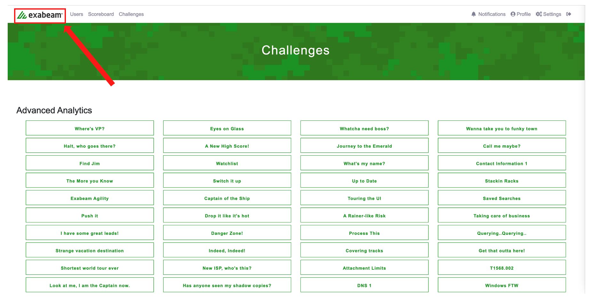
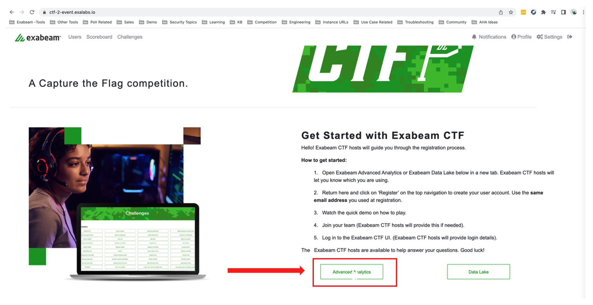
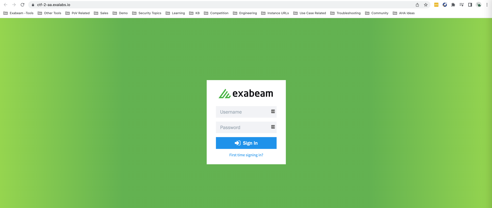

How to access Advanced Analytics platform:

1. If you've just registered and are now seeing challenges, click on the Exabeam logo on the top left corner to go back to front page.

	
	
2. On the front page, scroll down and click on 'Advanced Analytics' button. 

## Note
> Team 1, Team 2 and Team 3 will be using the Advanced Analytics 1  
> Team 4 and Team 5 will be using the Advanced Analytics 2  
	

	
3. A new tab will open and you will see a login for Advanced Analytics platform. The URL will look like https://ctf-X-aa.exalabs.io/, where X is 1~3.

	
	
4. Login credentials will be shared once everybody is ready to start the game.
