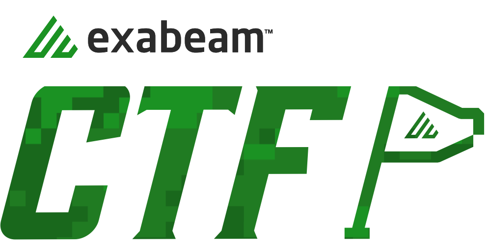
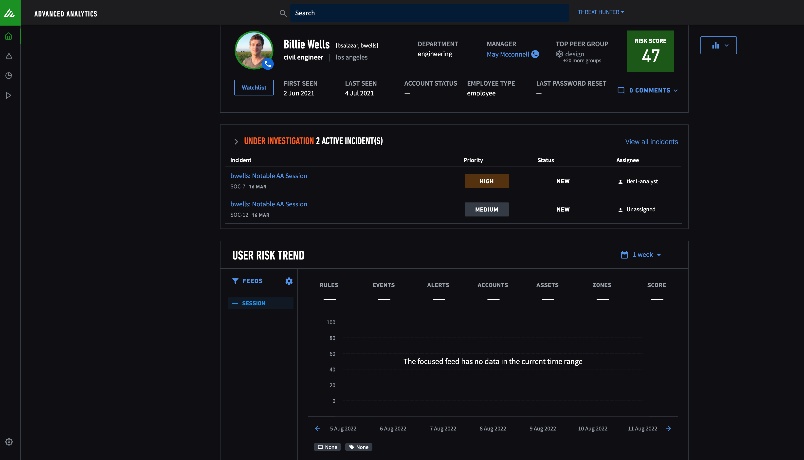
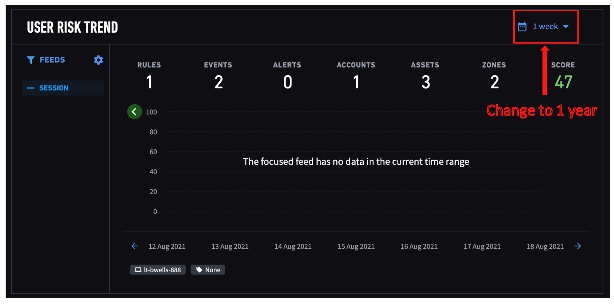
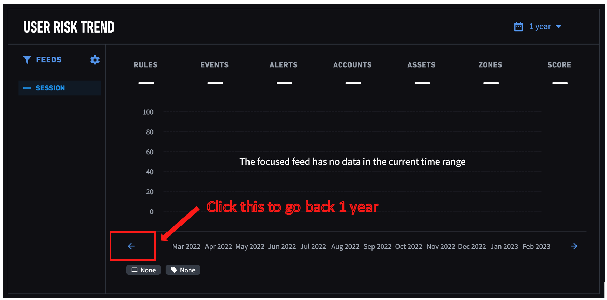
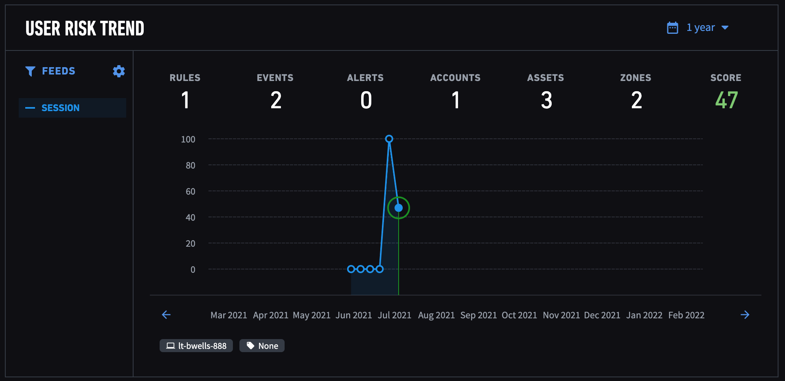

## Exabeam CTF

1. CTF event is hosted on a event URL - https://ctf-1-event.exalabs.io/

2. You will need to register an account (or your host will pre-provision for you before the event) to access the event URL to receive the challenges. [Check here for pre-provisioned accounts](./participants.csv)

3. **(If required)** [Follow this instruction to register and access the event URL](./HowTo/registration.md)

4. To solve the challenges, you will need access to the Advanced Analytics platform loaded with the game data - https://ctf-1-aa.exalabs.io/

5. The login credentials will only be shared when everyone is ready to play 

## Important tips:

1. You can solve most of the challenges using these main tools on Advanced Analytics platform:
	* [Notable lists/Watchlists]("./UI Navigation/notable_lists&watchlists.md")
	* [User Profile page](./UI Navigation/user_profile.md)
	* [User Timeline](./UI Navigation/timeline.md)
	* [Data Insights](./UI Navigation/data_insights.md)
	* [Threat Hunter](./UI Navigation/threat_hunter.md)

2. You will need to be aware of these concepts:
	* Notable threshold is 90
	* [What are normal and abnormal events on the timeline](./UI Navigation/timeline.md)
	* [What are trigggered rules and risk scores](./UI Navigation/timeline.md)

3. Game data is set in 2021. Relevant data has timestamp between Jun 02~Jul 05 2021. You will see empty data in present time on the AA UI.

	Example:
	
	To go back to the past data, click on "1 week" and change it to "1 year" from the dropdown
	
	Click on the left arrow to go back by a year
	
	You will now see the game data in 2021
	
	
4. You need to set end date to July 5, 2021 or later when using Threat Hunter. Our dataset has US timestamp, expanding the end date will ensure the entire data set is searched. [Refer to an example search here](./UI Navigation/threat_hunter.md#an-example-search)

## Other tips

1. [You can change the default dark mode to light mode](./How to Play/color_mode.md)
2. Join a breakout room and ask us anything. No penalty. :)
3. Have fun!

