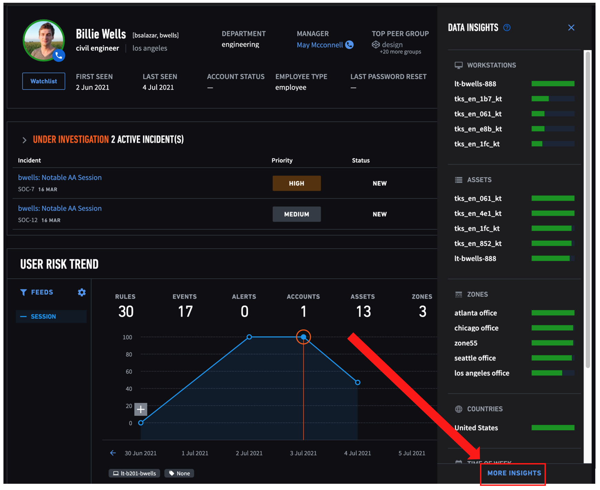
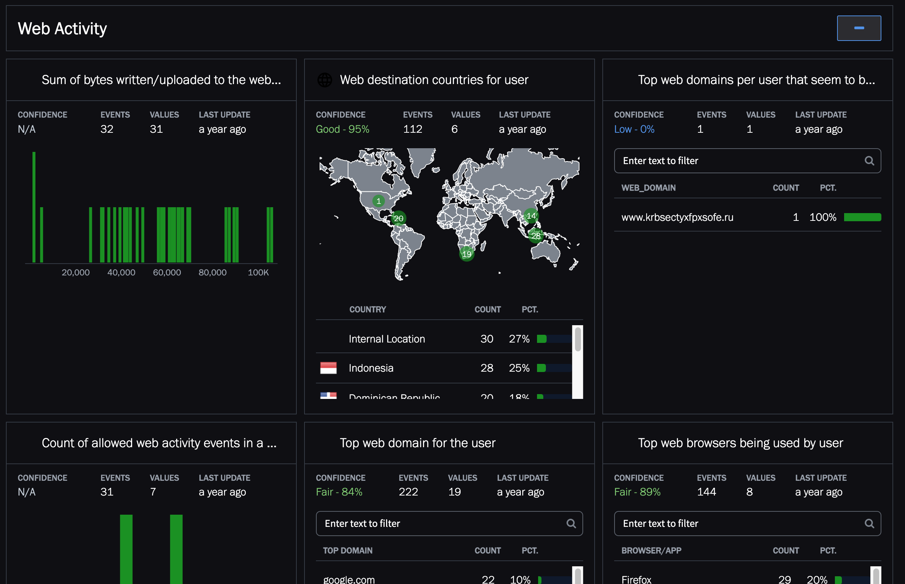

## How to access Data Insights specific to a user

From a user profile page, click on the "Chart" button on the top right

Then, click on "More insights"

On user's Data Ingsiths page, you will find various data models learnt from multiple sources:

For e.g, data models learnt from web activities

## Exploring all data models

1. Click on the ... on the top right corner to show a list of options
	
2. On the list, click on "Data Insights" 
	
3. Input partial or full model name. E.g usb
	
4. Click on "Get Histograms" to show the data