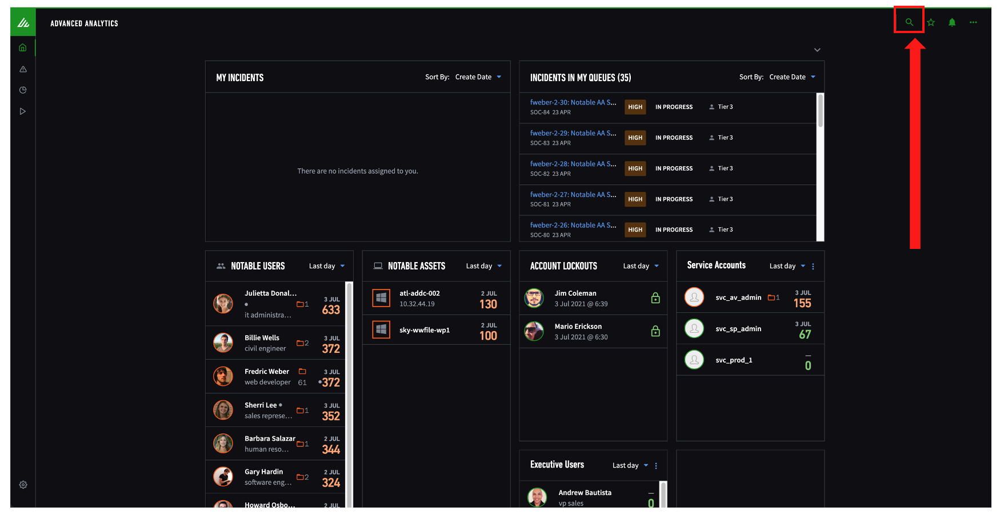
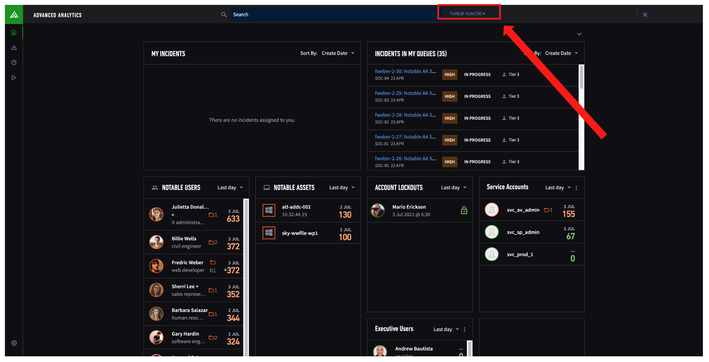
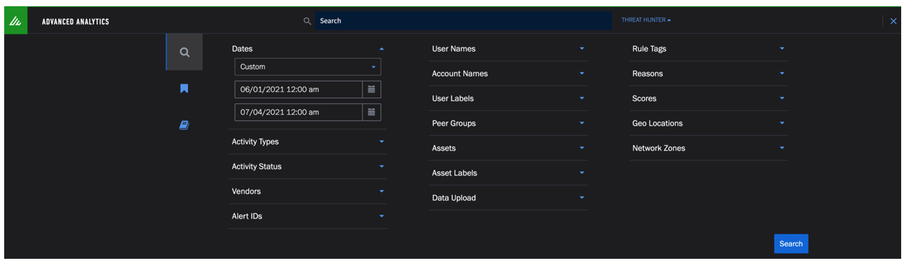
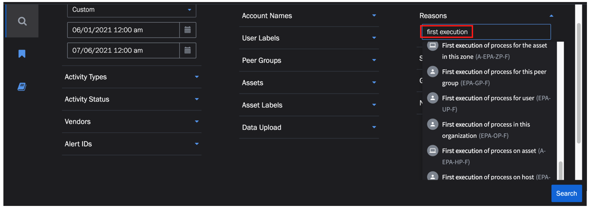
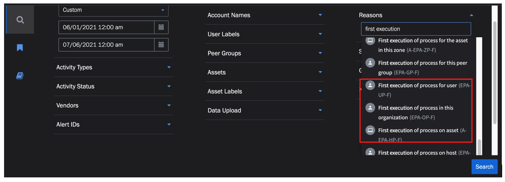
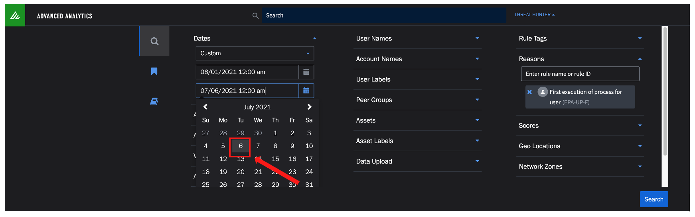
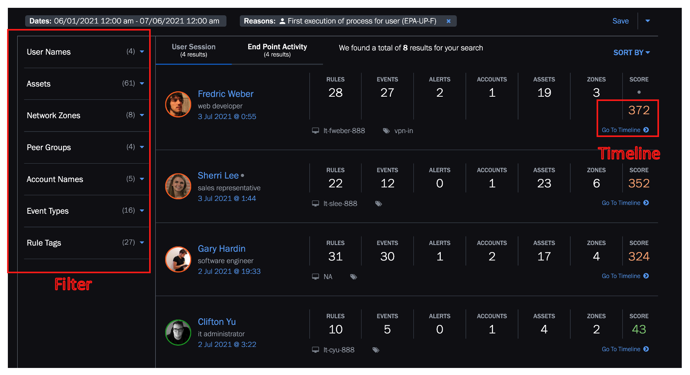

## How to access Threat Hunter

1. Click on the magnifying glass icon on the top right corner to reveal Threat Hunter search
	

2. Click on "Threat Hunter" to show more options
	

3. This allows you to search for user or asset sessions using various criterias 
	
	
## An example search

Search by risk reasons

1. From the options pane, click on "Reasons"

2. Input "first execution". Note that it will autocomplete to show all matching rules
	
3. The same rule may be scoped to user, peer group, organization, asset, host etc. Make sure you are choosing the right rule to search for. 
	
	
4. Set the end date to any date later than July 5, 2021.
	

5. This will returns user/asset sessions, from which you can pivot to timeline or perform further filter using the parameter list on the left
	