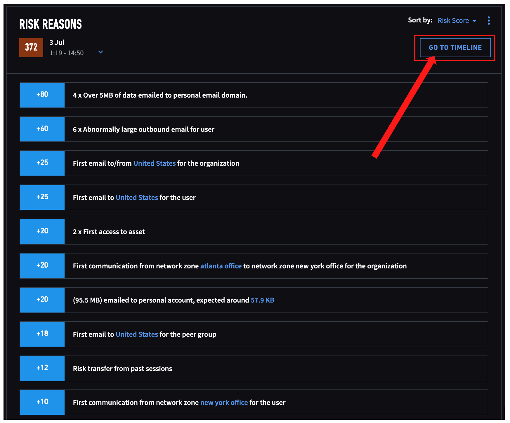
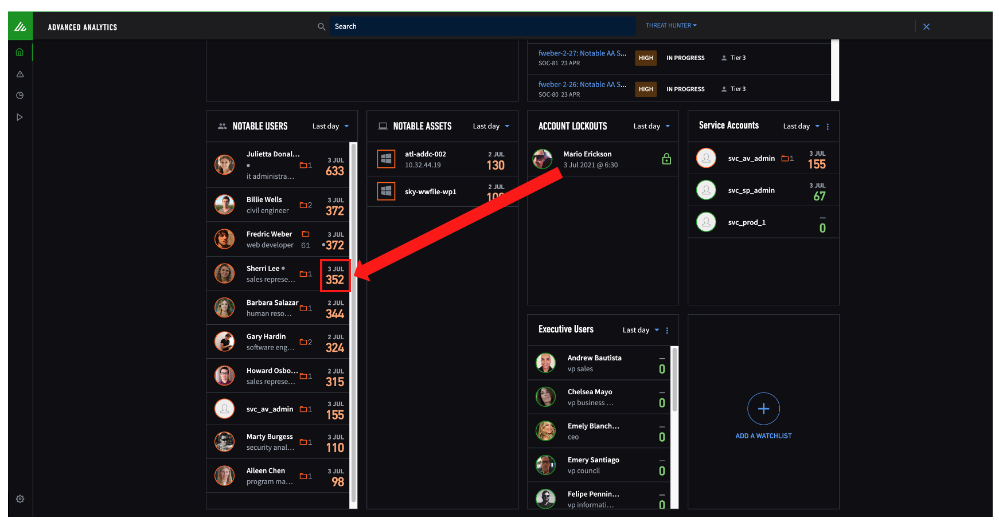
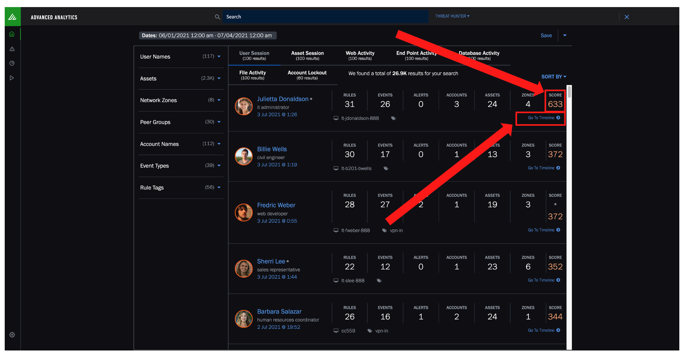
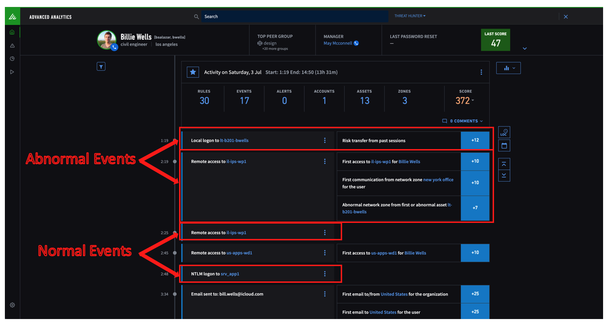
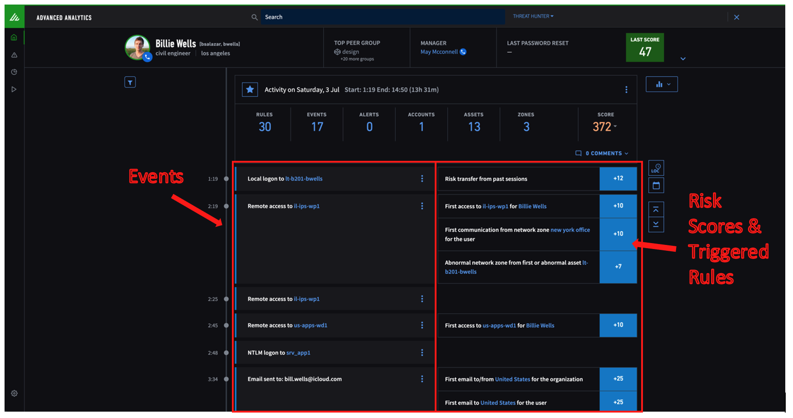
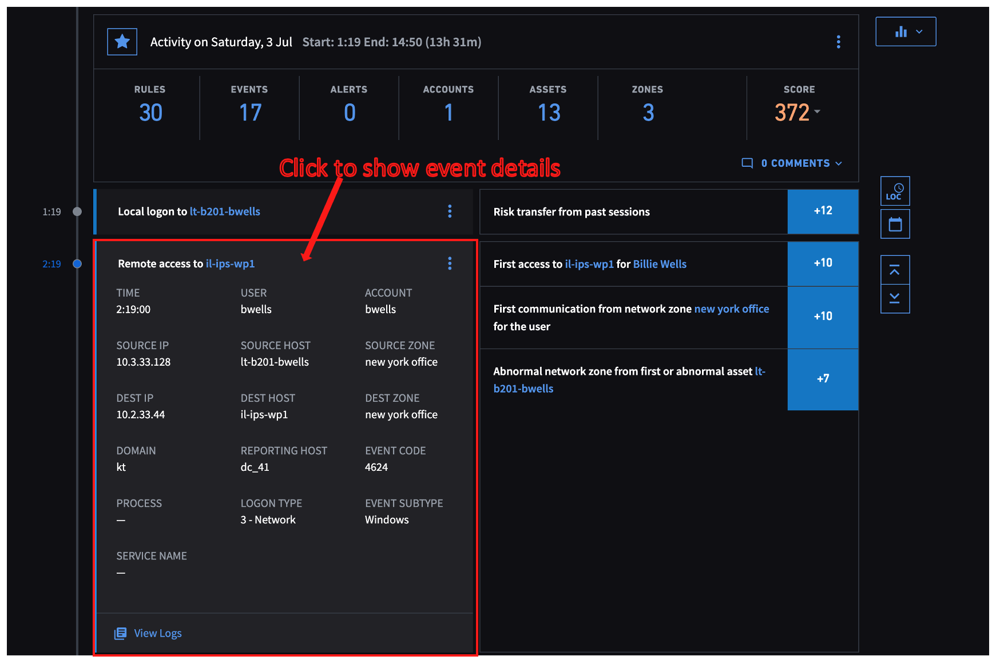

# A few ways to access a timeline

## Method #1

From a user profile page, go to "Risk Reasons" section and click on "Go To Timeline" button 

## Method #2

From landing page, click on the risk score

## Method #3

From Threat Hunter's results, click on the risk score or "Go To Timeline"

## What you can find on a timeline

Abnormal vs Normal Events

Abnormal Events - Risk Scores & Triggered Rules

**Note: One event may trigger multiple rules and scores

Click on any event to reveal more details
