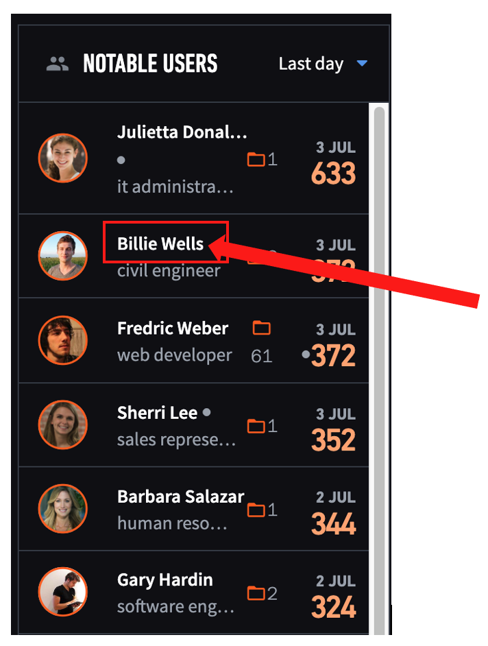
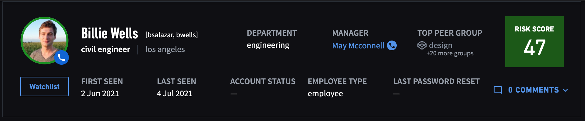
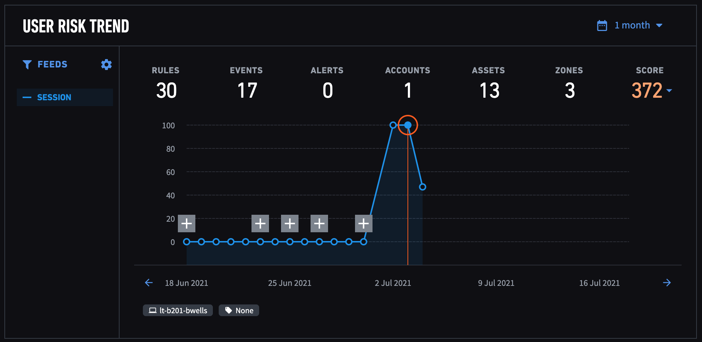
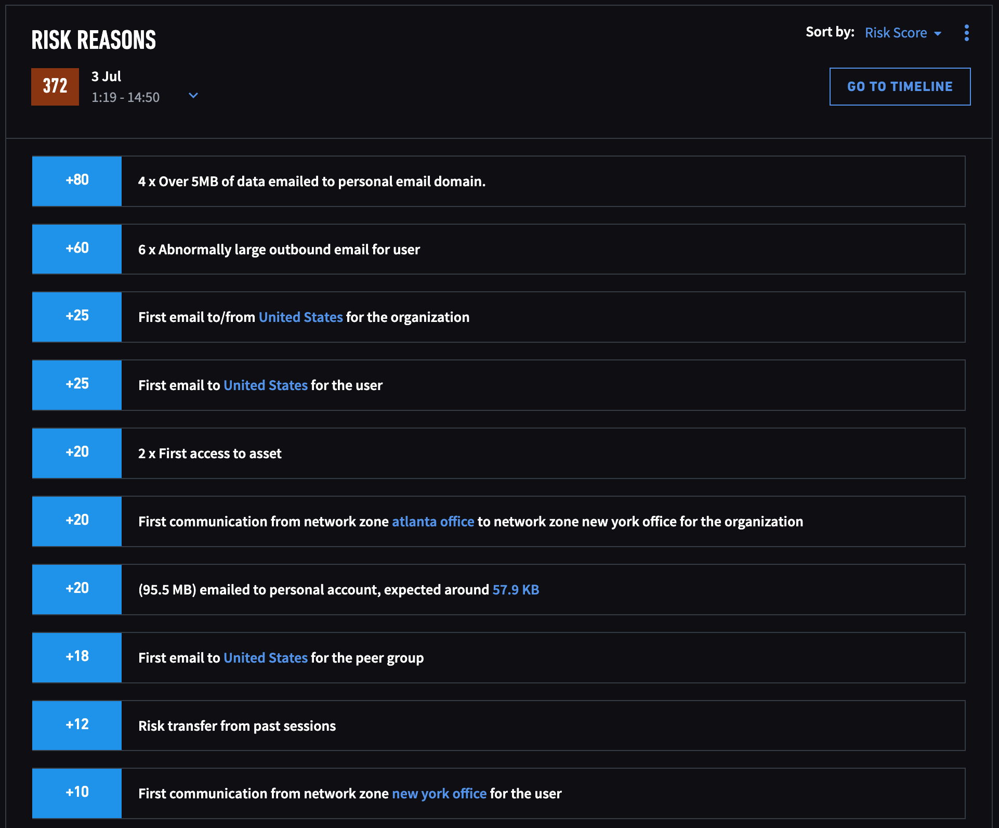

## How to access a user profile page

On the landing page, click on user's name 

## Information on user profile page

1. Top bar - Name, Role, Department, Location, Manager, Contact details etc

2. Risk trend - View of all notable and normal sessions within a selected time frame

3. Risk reasons - Risk scores and rules triggered
